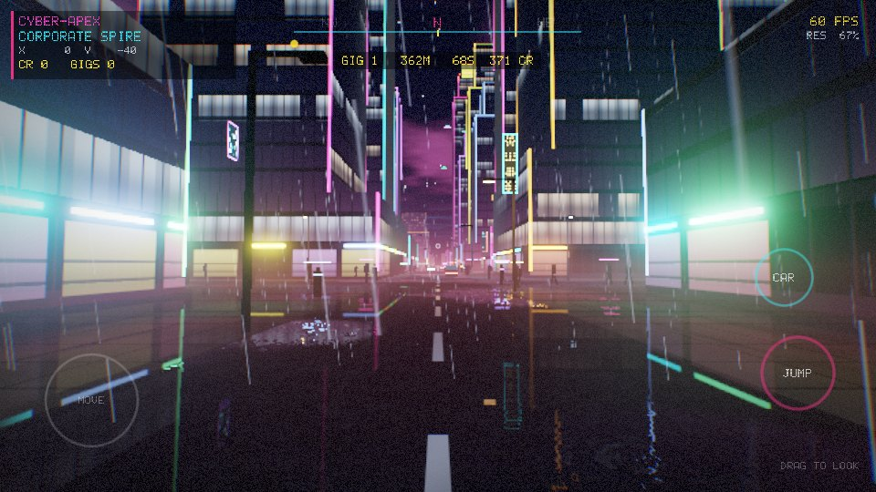
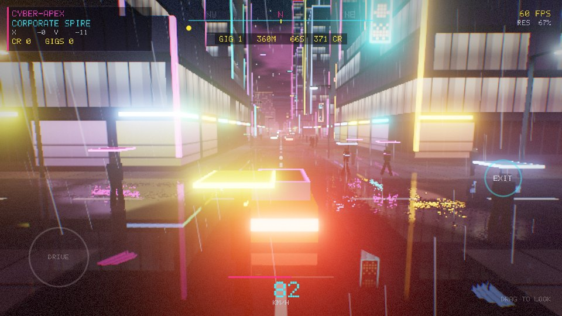
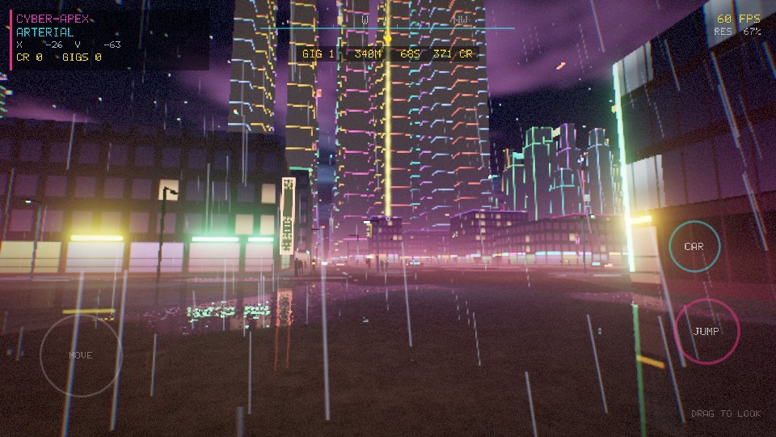
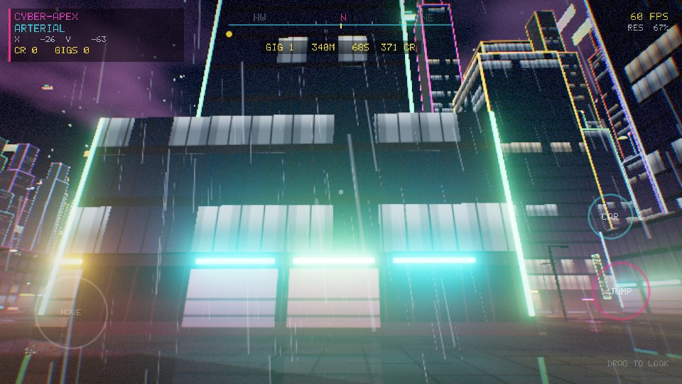

# CYBER-APEX

Android（Vulkan 1.3）向けの**オリジナル**サイバーパンク・オープンシティ。『Cyberpunk 2077』は画質・空気感の**目標**としてのみ参照しており、同作のアセット・名称・キャラクター・ストーリー・地名は一切使っていない（著作物のため）。

| | |
|---|---|
|  |  |
|  |  |

*画像はすべてこのリポジトリのレンダラーが lavapipe（CPU上のVulkan）で実際に出力したフレーム。*

- 原仕様: [`docs/SPEC.md`](docs/SPEC.md)
- 実現性レビューと修正版バジェット: [`docs/FEASIBILITY_REVIEW.md`](docs/FEASIBILITY_REVIEW.md)

## 遊べる内容

- **歩く・走る・ジャンプ**: 建物との当たり判定あり
- **車**: `CAR` ボタンで自分の車を呼び出して乗車、`EXIT` で降車。加速・ブレーキ・バック、速度に応じたステアリング、壁に当たると減速、追従カメラ
- **ギグ（配達ミッション）**: 250〜550 m 先に光の柱（ビーコン）が立つ。時間内に着くと満額、遅れると最低25%まで減額。クレジットが貯まり、次のギグが出る
- **街**: シード値だけから無限に生成（ボロノイ地区＋幹線道路＋区画グリッド）。移動に合わせてバックグラウンドでストリーミング
- **雰囲気**: 雨、濡れた路面のスクリーンスペース反射、ネオン看板（手続き生成の文字）、窓明かりと店舗、段状の超高層、街灯、傘をさした歩行者、地上と空の交通、雲、霧、ブルーム
- **音**: 素材ファイルなしの手続き合成（雨、シンセパッド、サブベース、足音、エンジン、ギグ達成音）

### 操作（横画面）

| 入力 | 動作 |
|---|---|
| 左半分をタッチ | その場に出るスティックで移動（縁まで倒すとダッシュ）／運転中はアクセル・ブレーキ・ハンドル |
| 右半分をドラッグ | 視点操作（運転中はカメラを回り込ませる） |
| `JUMP` / `CAR` ボタン | ジャンプ／車の呼び出し・乗降 |
| キーボード（エミュレータ・Chromebook） | WASD 移動、Shift ダッシュ、矢印キー視点、Space ジャンプ、F 車 |

## ビルド

### APK

必要なもの: JDK 17+、Android SDK（platform 36）、NDK `29.0.14206865`、CMake `3.31.6`。

```sh
./gradlew :android:assembleRelease   # android/build/outputs/apk/release/android-release.apk
```

arm64-v8a のみ、minSdk 30、**Vulkan 1.3 必須**（マニフェストで宣言）。release も debug 鍵で署名しているのでそのままインストールできるが、配布前に正式な署名設定に差し替えること。

### ホスト（テスト・スクリーンショット）

```sh
sudo apt install ninja-build glslang-tools libvulkan-dev zlib1g-dev mesa-vulkan-drivers vulkan-validationlayers
cmake -S . -B build -G Ninja && cmake --build build
ctest --test-dir build --output-on-failure
./build/apex_host --out city.png                 # 1フレーム描画してPNG出力（検証レイヤー有効）
./build/apex_host --present 300                  # APKと同じスワップチェーン経路をheadless surfaceで回す
./build/apex_host --out drive.png --drive 2.5    # 車を呼んで2.5秒走った画
./build/apex_host --audio soundscape.wav         # 20秒のサウンドデモ
```

## 構成

```
engine/     プラットフォーム非依存（ホストでテスト可能）
  citygen   シード駆動の都市レイアウト（整数ハッシュのみ。<random> は実装依存なので不使用）
  world     タイルストリーミング、ビルの段状マッシング、看板配置、当たり判定
  game      歩行／運転、ギグ、ジャンプ
  hud       HUDレイアウト（5x7ドット文字をクアッドごとに持たせるのでフォントテクスチャ不要）
  audio     手続き合成シンセ（リアルタイム安全：レンダー中に確保・ロックなし）
renderer/   Vulkan 1.3（dynamic rendering + synchronization2）
  renderer  シーン → SSR → ブルーム → トーンマップ／アップスケール → HUD、GPU時間計測と動的解像度
  presenter スワップチェーン（Androidのpre-rotation対応）、Android とホストで共用
shaders/    GLSL（ビルド時にSPIR-Vへコンパイルしてバイナリに埋め込み）
android/    NativeActivity、タッチ操作、AAudio
host/       ヘッドレス実行（スクリーンショット、present経路、WAV書き出し）
```

描画パス（内部解像度は出力の0.5〜0.75倍、GPU時間13 msを目標に自動調整）:

1. **シーン**: HDR色 + 材質（反射率・粗さ・法線の揺らぎ）+ 深度（reversed-Z、無限遠）。ビル・地面・看板・車・歩行者・街灯・空・ビーコン・雨
2. **解決**: 濡れた路面だけスクリーンスペースでレイマーチ（24ステップ＋二分探索）、水面のフレネル
3. **ブルーム**: 6段、13タップ縮小（初段はKaris平均で輝点のちらつき抑制）＋テント拡大
4. **トーンマップ**: ACES、色収差、ビネット、グレイン、出力解像度へのアップスケール、Androidの画面回転をここで吸収
5. **HUD**

## 検証状況（正直に）

| 項目 | 状態 |
|---|---|
| ユニットテスト（都市生成、ストリーミング、当たり判定、ギグ、ジャンプ、運転、音） | ✅ 全通過（ASan/UBSan） |
| 描画・present経路 | ✅ lavapipe＋Khronos検証レイヤーでエラーなし |
| APKビルド | ✅ Gradle + NDK r29、16KBページ整列、依存はシステムライブラリのみ |
| **実機での動作** | ❌ **未検証**。この開発環境にはAndroid端末もKVMもない。実機で最初に確認すべきは起動、タッチ座標、画面回転、フレームレート |
| 実機の性能・発熱 | ❌ 未計測。動的解像度で逃がす設計だが、数値は実機のGPUタイマーで要確認 |

## 仕様書との対応（主なもの）

- §3.2 トライプラナー・マイクロディテール、§3.3 2ch法線、§3.4 法線分散→ラフネス、§4.1 クラスタカリング: `engine/` と `shaders/` に実装・テスト済みだが、**テクスチャを使うアセットがまだ無い**ため、ゲーム本体の描画には未接続（今の見た目はすべて手続き生成）
- §4.3 動的解像度: 実装済み（GPUタイムスタンプ駆動）。ニューラル超解像・フレーム生成は未実装（レビューの通り、ベンダーSDKのGPU経路が第一候補）
- §5 手続き都市・ストリーミング: 実装済み
- §4.2 NRC / レイトレース反射: 未実装（レビューで研究トラックに降格）
